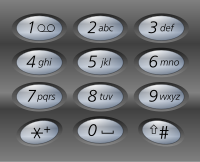

# 题目描述
给定一个仅包含数字 2-9 的字符串，返回所有它能表示的字母组合。答案可以按 任意顺序 返回。

给出数字到字母的映射如下（与电话按键相同）。注意 1 不对应任何字母。



# 示例
**示例 1**：
- 输入：digits = "23"
- 输出：["ad","ae","af","bd","be","bf","cd","ce","cf"]

**示例 2**：
- 输入：digits = ""
- 输出：[]

**示例 3**：
- 输入：digits = "2"
- 输出：["a","b","c"]

# 解法一 回溯
首先使用哈希表存储每个数字对应的所有可能的字母，然后进行回溯操作。

回溯过程中维护一个字符串，表示已有的字母排列（如果未遍历完电话号码的所有数字，则已有的字母排列是不完整的）。该字符串初始为空。每次取电话号码的一位数字，从哈希表中获得该数字对应的所有可能的字母，并将其中的一个字母插入到已有的字母排列后面，然后继续处理电话号码的后一位数字，直到处理完电话号码中的所有数字，即得到一个完整的字母排列。然后进行回退操作，遍历其余的字母排列。

回溯算法用于寻找所有的可行解，如果发现一个解不可行，则会舍弃不可行的解。在这道题中，由于每个数字对应的每个字母都可能进入字母组合，因此不存在不可行的解，直接穷举所有的解即可。

>java
```java
import java.util.ArrayList;
import java.util.Arrays;
import java.util.HashMap;
import java.util.LinkedList;
import java.util.List;
import java.util.Map;
import java.util.Queue;

public class Main{
    public static void main(String[] args) {
        System.out.println(letterCombinations("23"));
    }
    public static List<String> letterCombinations(String digits) {
        List<String> combinations = new ArrayList<String>();
        if (digits.length() == 0) {
            return combinations;
        }
        // 构建字符集
        Map<Character, String> phoneMap = new HashMap<Character, String>() {{
            put('2', "abc");
            put('3', "def");
            put('4', "ghi");
            put('5', "jkl");
            put('6', "mno");
            put('7', "pqrs");
            put('8', "tuv");
            put('9', "wxyz");
        }};
       
        backtrack(combinations, phoneMap, digits, 0, new StringBuffer());
        return combinations;
    }
   /**
    * 回溯算法
    * @param combinations 收集所有符合的元素
    * @param phoneMap  字符集映射
    * @param digits 索引
    * @param index 索引长度，判断是否遍历完成
    * @param combination 字符串构造器
    */
    public static void backtrack(List<String> combinations, Map<Character, String> phoneMap, String digits, int index, StringBuffer combination) {
        if (index == digits.length()) {
            combinations.add(combination.toString());
        } else {
            char digit = digits.charAt(index);
            String letters = phoneMap.get(digit);
            int lettersCount = letters.length();
            for (int i = 0; i < lettersCount; i++) {
                combination.append(letters.charAt(i));
                backtrack(combinations, phoneMap, digits, index + 1, combination);
                combination.deleteCharAt(index);
            }
        }
    }
    
}


```
>go
```go
package main

import (
	"fmt"
	"strings"
)


func main() {
	fmt.Println(letterCombinations("23"))
}
func letterCombinations(digits string) []string {
	combinations := make([]string, 0, 10)
	if len(digits) == 0 {
		return combinations
	}
	phoneMap := map[byte]string{
		'2': "abc",
		'3': "def",
		'4': "ghi",
		'5': "jkl",
		'6': "mno",
		'7': "pqrs",
		'8': "tuv",
		'9': "wxyz",
	}
	var strbuf strings.Builder
	backtrack(&combinations, phoneMap, &digits, 0, &strbuf)
	return combinations

}
func backtrack(combinations *[]string, phoneMap map[byte]string, digits *string, index int, combination *strings.Builder) {
	if index == len(*digits) {
		*combinations = append(*combinations, combination.String())
	} else {
		digit := (*digits)[index]
		letters := phoneMap[digit]
		lettersCount := len(letters)
		for i := 0; i < lettersCount; i++ {
			combination.WriteByte(letters[i])
			backtrack(combinations, phoneMap, digits, index+1, combination)
			str := combination.String()
			combination.Reset()
			combination.WriteString(str[:len(str)-1])
		}
		fmt.Println(combination.String())
	}
}


```
>rust
```rs
use std::collections::HashMap;


fn main() {

  let str=letter_combinations(String::from("23"));
  str.iter().for_each(|x|{
    print!("{}," ,x);
  });
}
pub fn letter_combinations(digits: String) -> Vec<String> {
  let mut combinations=vec![];
  if digits.len()==0{
    return  combinations;
  }
  let phone_map =HashMap::from([
    ('2', "abc"),
    ('3', "def"),
    ('4', "ghi"),
    ('5', "jkl"),
    ('6', "mno"),
    ('7', "pqrs"),
    ('8', "tuv"),
    ('9', "wxyz")
  ]);
  let mut combination=String::new();
  backtrack(&mut combinations, &phone_map, &digits, 0,&mut combination);
  return  combinations;
}
fn backtrack(combinations:&mut Vec<String>, phone_map:&HashMap<char,&str>, digits:&String, index: usize,combination:&mut String) {
    if index==digits.len() {
        combinations.push(combination.clone());
    }else {
      let degit=digits.chars().nth(index).unwrap();
      let letters=phone_map.get(&degit).unwrap();
      for i in 0..letters.len() {
          combination.push(letters.chars().nth(i).unwrap());
          backtrack(combinations, phone_map, digits, index+1, combination);
          combination.pop();
      }
    }

```