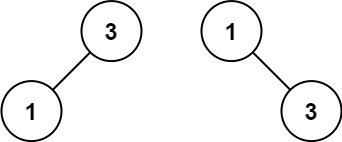
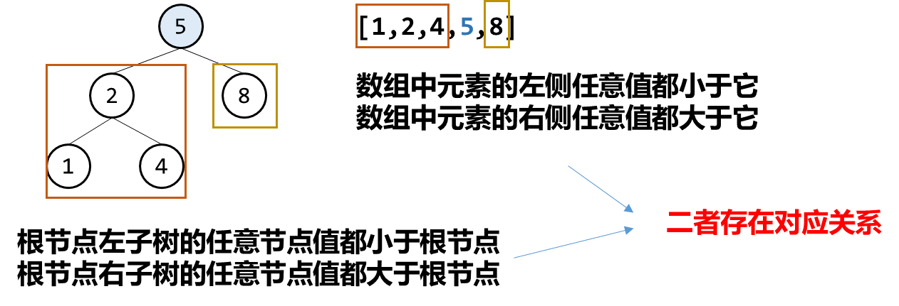

# 题目描述
给你一个整数数组 nums ，其中元素已经按 升序 排列，请你将其转换为一棵 高度平衡 二叉搜索树。

高度平衡 二叉树是一棵满足「每个节点的左右两个子树的高度差的绝对值不超过 1 」的二叉树。

# 示例
**示例一**


- 输入：nums = [-10,-3,0,5,9]
- 输出：[0,-3,9,-10,5]
- 解释：[0,-10,5,-3,9] 也将被视为正确答案：


**示例二**

- 输入：nums = [1,3]
- 输出：[3,1]
- 解释：[1,3] 和 [3,1] 都是高度平衡二叉搜索树。

**注意**
nums 按 严格递增 顺序排列

# 题解一 分治法
这道题要根据给定的升序数组构造一个二叉搜索树。

二叉搜索树的特征是：对于树上的任意一个节点，其左子树的所有节点值都小于它，其右子树的所有节点值都大于它。而给定数组 nums 是一个严格递增的数组，对于其中任意一个数字，其左侧的数字都小于它，其右侧的数字都大于它。


**分治**
因为题目要求得到一棵高度平衡的二叉搜索树，即任意一个节点的左右子树高度差绝对值不超过1。我们可以假设绝对一点，根节点的左右子树都是链式结构，那么左右子树的高度就是左右子树节点个数。要使高度差绝对值不超过 1，即 左右子树的节点数差值绝对值不超过 1。所以我们因该找到中点作为我们的根节点。
>java版本
```java
import java.util.ArrayList;
import java.util.Arrays;
import java.util.LinkedList;
import java.util.List;
import java.util.Queue;

public class TreeNode {
    int val;
    TreeNode left;
    TreeNode right;
    TreeNode() {}
    TreeNode(int val) { this.val = val; }
    TreeNode(int val, TreeNode left, TreeNode right) {
        this.val = val;
        this.left = left;
        this.right = right;
    }
    public static void main(String[] args) {
        int[] nums1={1,3};
       System.out.println(levelOrder(sortedArrayToBST(nums1)));
    }
    public  static TreeNode sortedArrayToBST(int[] nums) {
    return sortedArrayToBST(Arrays.stream(nums).boxed().toList());
    }
    private static TreeNode sortedArrayToBST(List<Integer> asList) {
        int center=(asList.size())/2;
        TreeNode treeNode=new TreeNode(asList.get(center));
        // 递归构建左右子树
        if (center>0) {
            treeNode.left=sortedArrayToBST(asList.subList(0, center));
        }
        if (center<asList.size()-1) { 
            treeNode.right=sortedArrayToBST(asList.subList(center+1,asList.size()));
        }
        return treeNode;
    }
    // 层次遍历便于输出结果进行测试
    private static List<Integer>  levelOrder(TreeNode treeNode){
        List<Integer> result = new ArrayList<>();
        if (treeNode== null) {
            return result;
        }

        Queue<TreeNode> queue = new LinkedList<>();
        queue.offer(treeNode);

        while (!queue.isEmpty()) {
            // 获取当前层的所有节点数量
            int currentLevelSize = queue.size();    
            for (int i = 0; i < currentLevelSize; i++) {
                // 出队当前层的第一个节点
                TreeNode currentNode = queue.poll();
                // 添加节点值到当前层列表
                result.add(currentNode.val);
                
                // 将其子节点入队（如果存在）
                if (currentNode.left != null) {
                    queue.offer(currentNode.left);
                }
                if (currentNode.right != null) {
                    queue.offer(currentNode.right);
                }
            }
        }

        return result;
    }
}


```
>GoLang版本
```go
package main

import (
	"container/list"
	"fmt"
	// "fmt"
)

type TreeNode struct {
	Val   int
	Left  *TreeNode
	Right *TreeNode
}

func main() {
	nums := []int{-10, -3, 0, 5, 9}
	fmt.Print()
	fmt.Println(*levelOrder(sortedArrayToBST(nums)))
}
func sortedArrayToBST(nums []int) *TreeNode {
	center := len(nums) / 2
	tree_node := &TreeNode{nums[center], nil, nil}
	// 递归构建左右子树
	if center > 0 {
		tree_node.Left = sortedArrayToBST(nums[0:center])
	}
	if center < len(nums)-1 {
		tree_node.Right = sortedArrayToBST(nums[center+1 : len(nums)])
	}
	return tree_node
}
// 层次遍历用于输出
func levelOrder(tn *TreeNode) *[]int {
	result := make([]int, 0, 10)
	if tn == nil {
		return &result
	}
	list := list.New()
	list.PushBack(tn)
	for list.Len() != 0 {
		numl := list.Len()
		for i := 0; i < numl; i++ {
			first := list.Front()
			fv := first.Value.(*TreeNode)
			result = append(result, fv.Val)
			if fv.Left != nil {
				list.PushBack(fv.Left)
			}
			if fv.Right != nil {
				list.PushBack(fv.Right)
			}
			list.Remove(first)
		}
	}
	return &result

}
```
>Rust版本
```rs
```


